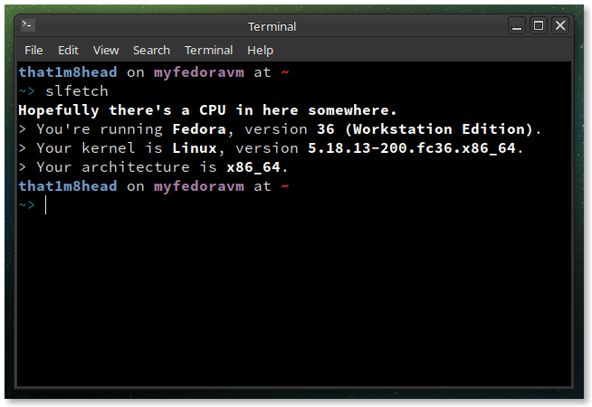

# slfetch

A [`nofetch`](https://github.com/not-my-segfault/nofetch)-inspired fetch tool.

`slfetch` displays system information in a simple and user-friendly way, written in bash.

No ASCII. No slowdowns. No complicated crap. Just fetch.

## Installing

1. `git clone https://github.com/that1m8head/slfetch`
2. `cd slfetch`
3. `chmod +x slfetch`
4. `sudo make install`

## Usage

`slfetch`.

## Dependencies

Basically any *nix system should have these.

+ `sudo` or `doas`, otherwise run `make install` as root
+ `bash` or compatible shell
+ `grep`
+ `head`
+ `sed`
+ `cat`
